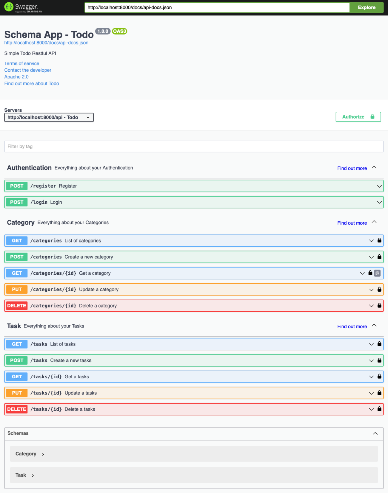
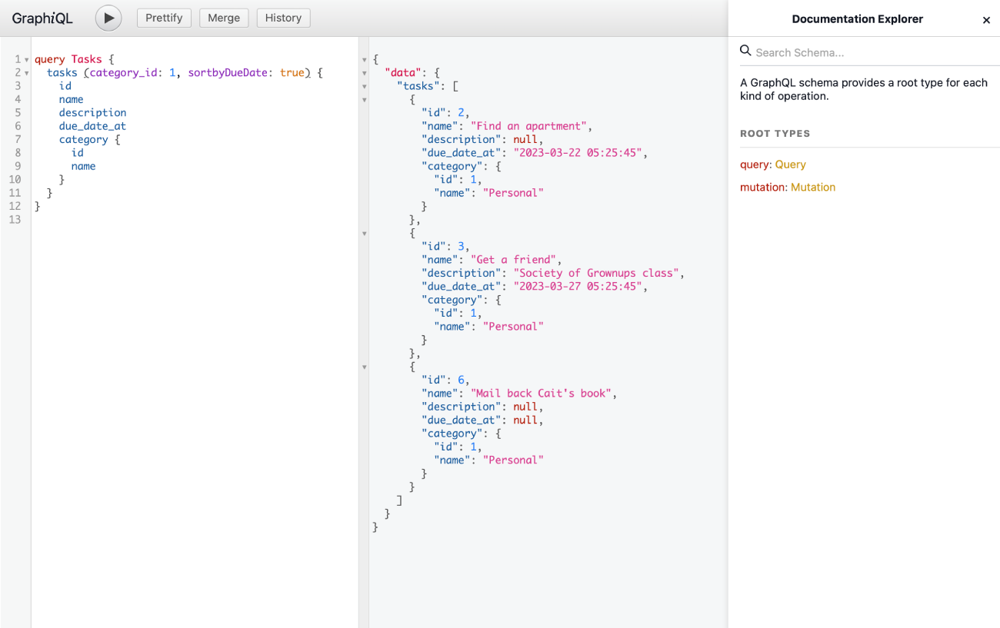

## Todo

Backend API in Restful & GraphQL for Todo application

## Techical Stack

- PHP 8
- Laravel 10
- MySQL 8
- Docker
- NGINX
- Restful
- Swagger
- GraphQL
- Git & GitHub


## Instructions to Run

The instructions assume that you have already installed [Docker](https://docs.docker.com/get-docker/) and [Docker Compose](https://docs.docker.com/compose/install/).

### Step 1: Download the Repository

Either Clone the repository using git clone or install via zip and extract to any of your folders you wish.

```bash
$ git clone https://github.com/hamed-valiollahi/todo.git
```

### Step 2: Start the Environment

Navigate to the directory in which you cloned the project and run:

```bash
$ docker-compose build app
$ docker-compose up -d
```

### Step 3: Initialize the Application

To install the composer dependencies, and a few other tasks run:

```bash
$ docker-compose exec app rm -rf vendor composer.lock
$ docker-compose exec app composer install
$ docker-compose exec app php artisan key:generate
$ docker-compose exec app php artisan l5-swagger:generate
```

And run the initial migrations and seeders.

```bash
$ docker-compose exec app php artisan migrate:fresh --seed
```

### Step 4. Running

Your application is now ready!
Now go to your browser and access your server’s IP address on port 8000:

Restful APIs:
- Swagger: http://localhost:8000/api/documentation



> **Note**
> You need to register and then login to get a token to access the APIs.
> Please remember that 'Bearer' required before the token in 'Authorization' header.

GraphQL APIs:
- GraphiQL: http://localhost:8000/graphiql



### Testing
Use the following command to run PHPUnit from the terminal:

```bash
$ docker-compose exec app php artisan test
```

Example:
```bash
  PASS  Tests\Feature\API\CategoryTest
  ✓ category created successfully
  ✓ category listed successfully
  ✓ retrieve category successfully
  ✓ category updated successfully
  ✓ delete category

   PASS  Tests\Feature\API\RegisterTest
  ✓ required fields for registration
  ✓ repeat password
  ✓ successful registration
  ✓ must enter email and password
  ✓ successful login

   PASS  Tests\Feature\API\TaskTest
  ✓ task created successfully
  ✓ task listed successfully
  ✓ retrieve task successfully
  ✓ task updated successfully
  ✓ delete task

  Tests:    15 passed (47 assertions)
  Duration: 3.36s
```

## Todo list
Here is some works needed to be done:
- Implement repository pattern and update code & unit tests accordingly
- Authentication for GraphQL APIs
- Implement Authorization
- Multi user tasks

## Questions

For questions, please feel free to contact me at <hamedv90@gmail.com>
